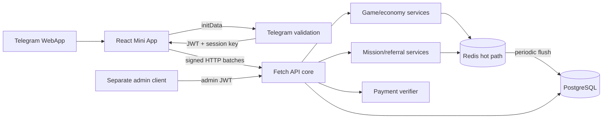

# MTX Telegram Mini App

MTX is a TypeScript Telegram tap-to-earn mini app with a React/Vite client and a Fetch-compatible server core. It includes server-authoritative taps and energy, offline profit, configurable economy, store/inventory, wallet verification hooks, missions, daily challenges, referrals, Redis leaderboards, an isolated admin flow and replay-safe request signing.

## Requirements

- Node.js 22.6 or newer (Node 24 LTS recommended)
- pnpm 9 or newer
- A Telegram bot token for real Telegram authentication
- PostgreSQL and Redis for production; local development uses in-memory adapters

## Run locally

```bash
corepack enable
pnpm install --frozen-lockfile
copy .env.example .env
```

On macOS/Linux use `cp .env.example .env`. Put a real BotFather token in `.env` only when testing inside Telegram.

Start the API and frontend in two terminals:

```bash
pnpm server:dev
pnpm dev
```

Open `http://localhost:5173`. Outside Telegram the UI runs in demo mode; authenticated API actions require valid Telegram `initData`.

## Quality checks

```bash
pnpm check
pnpm lint
pnpm test
pnpm build
```

The current baseline is 53 passing tests. The Phase 9 initial bundle budget is less than 100 KiB gzip JavaScript and 5 KiB gzip CSS.

### Real infrastructure integration

The integration runner is deliberately disabled by default because it runs migrations and writes temporary records. The built-in Node provider reads `DATABASE_URL` and `REDIS_URL`:

```bash
DATABASE_URL=postgresql://... \
REDIS_URL=rediss://... \
MTX_INTEGRATION_ALLOW_WRITE=true \
pnpm test:integration
```

The runner verifies versioned migrations, PostgreSQL rollback, atomic Redis batch claims, stale game-state rejection and Redis-to-PostgreSQL tap flushing. It refuses to run without the explicit write flag and removes its own UUID-scoped records afterward. Use `pnpm db:migrate` before starting the API and `pnpm server:start` for the persistent Node runtime.

## Architecture



Detailed documentation:

- [Architecture](docs/ARCHITECTURE.md)
- [API reference](docs/API.md)
- [Folder guide](docs/FOLDERS.md)
- [Deployment guide](docs/DEPLOYMENT.md)
- [Security boundary](SECURITY.md)
- [Economy specification](ECONOMY-SPEC.md)

## Important production boundary

The local runner intentionally uses process memory and does not represent a multi-instance production deployment. Real rewards or payments must not launch until Redis, PostgreSQL, payment verification, WebSocket/pub-sub and admin authentication bindings are configured as described in the deployment guide.

## Telegram setup

1. Create the bot with BotFather and set its Mini App URL to the deployed HTTPS frontend.
2. Store the bot token only in the backend secret manager.
3. Set `APP_ORIGIN` to the exact frontend origin, without a trailing path.
4. Configure the frontend `VITE_API_BASE` and `VITE_LEADERBOARD_WS` before building.
5. Open the app through `https://t.me/<bot_username>?startapp` and verify authentication, theme, Back Button and haptics.

## Version

`2.0.0-mtx`
