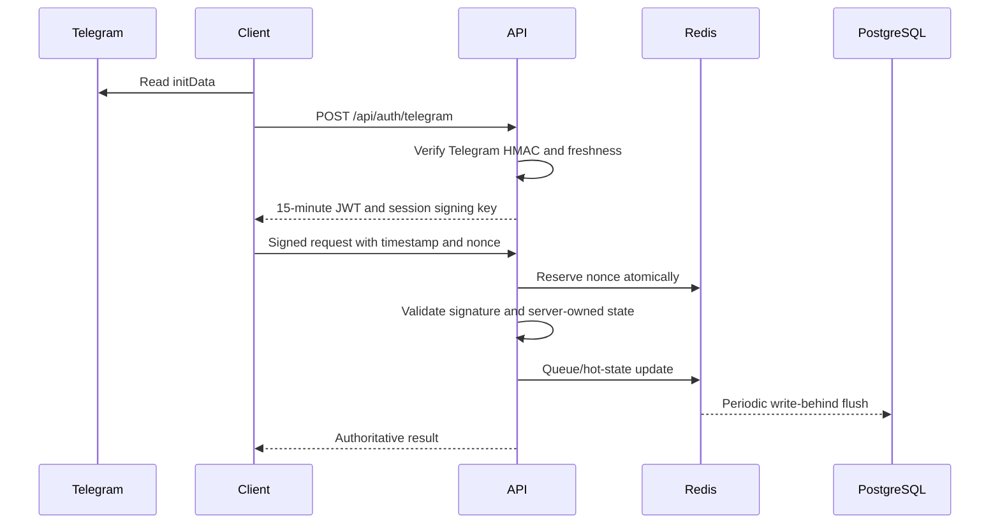

# Architecture

## Runtime boundaries

The frontend is React 18 with React Router, Zustand and Axios. Pages are lazy-loaded. UI components render state; hooks coordinate lifecycle behavior; services own HTTP, Telegram and wallet interactions; Zustand slices hold user, game, wallet and inventory state.

The server core uses the standard `Request`/`Response` API in `server/src/app.ts`. `server/src/worker.ts` is the production composition root: it attaches Redis/PostgreSQL adapters, leaderboard pub/sub, WebSocket upgrades, payment verification and admin authentication. `server/localServer.mjs` is a development-only in-memory adapter.

## Authenticated request sequence

## Domain ownership

| Domain | Client | Server | Production persistence |
|---|---|---|---|
| Authentication | Telegram SDK and token memory | initData/JWT/request verification | Redis nonce TTL |
| Game | optimistic display and tap batching | energy, rate, income, offline profit | Redis queue + PostgreSQL state |
| Economy | display | versioned formulas and price checks | economy config binding |
| Commerce | catalog/inventory UI | idempotent purchase/payment handling | PostgreSQL/provider verifier |
| Social | mission/daily/referral UI | eligibility, claims, anti-abuse | PostgreSQL + Redis leaderboard |
| Admin | separate protected routes | separate JWT role/scope checks | production admin/audit adapter |

## Failure model

- Redis must be shared by every API instance; otherwise replay and hot-state guarantees become instance-local.
- PostgreSQL writes use conflict-safe keys for claims and idempotency.
- Tap events enter Redis before periodic persistence, avoiding one database write per tap.
- Payment callbacks must be verified and deduplicated by transaction ID.
- Anomalies are recorded for review and do not automatically ban a player on the first event.
